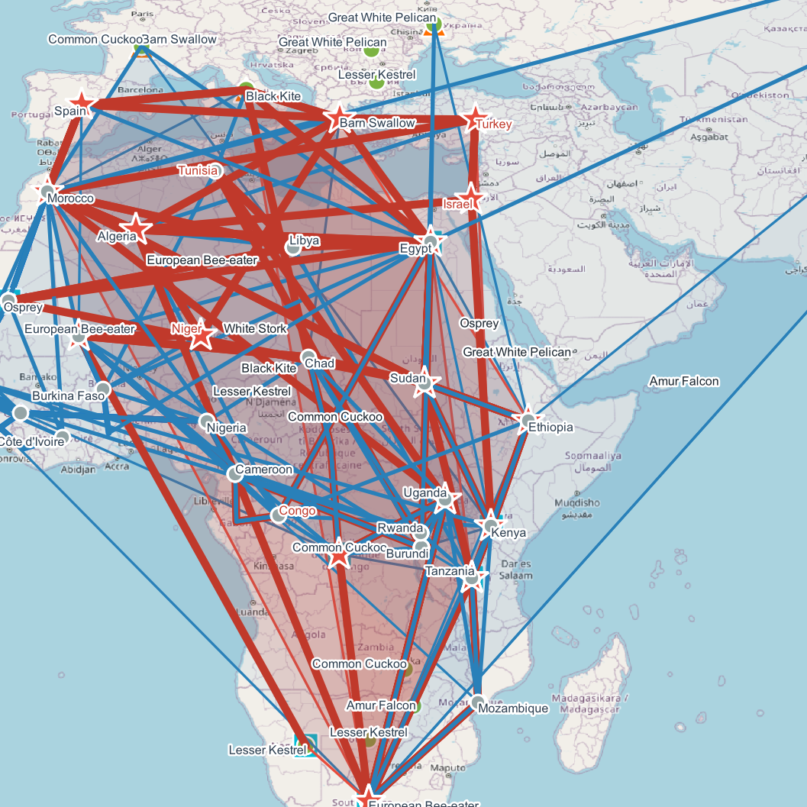
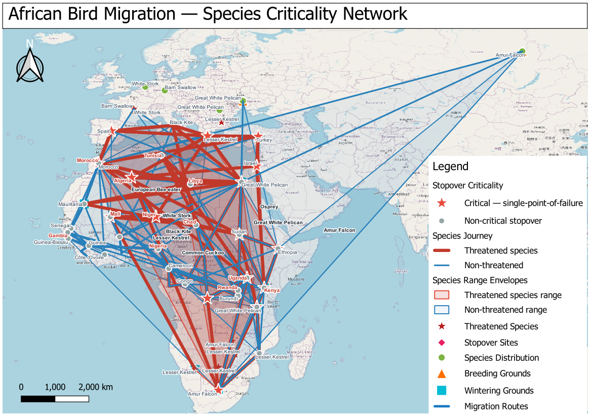

# African Bird Migration — Species Criticality Network

> **A species-level network analysis** that reconstructs the complete annual migration
> journey of 10 African-Eurasian bird species and identifies which stopover sites are
> single-points-of-failure: nodes whose removal would leave a species with no viable
> resting place within 500 km.

---

## Table of Contents

1. [Project Overview](#project-overview)
2. [How This Differs from the Corridor Vulnerability Analysis](#how-this-differs)
3. [Folder Structure](#folder-structure)
4. [Input Layers](#input-layers)
5. [Output Layers](#output-layers)
6. [Methodology — Full Pipeline](#methodology)
7. [Criticality Index Formula](#criticality-index-formula)
8. [Results](#results)
9. [Layer Symbology](#layer-symbology)
10. [Project Configuration](#project-configuration)
11. [Reference Map](#reference-map)
12. [How to Reproduce](#how-to-reproduce)
13. [File Inventory](#file-inventory)

---

## Project Overview

| Property | Value |
|---|---|
| **Project title** | African Bird Migration — Species Criticality Network |
| **Project file** | `African_Bird_Criticality_Network.qgz` |
| **CRS** | EPSG:4326 — WGS 84 |
| **Spatial extent** | -22°W to 115°E, -38°S to 66°N |
| **Species analysed** | 10 |
| **Stopover sites scored** | 96 |
| **Critical nodes identified** | 21 single-points-of-failure |
| **Exclusion radius** | 500 km (alternative stopover search) |
| **QGIS version** | 3.40.14-Bratislava |

The central question this analysis answers:

> **Which individual stopover sites, if lost, would leave a threatened species with
> no viable resting point along its migration route?**

Unlike the companion Corridor Vulnerability Analysis (which aggregates all species
into corridor-level polygons), this analysis keeps each species as an individual
entity with a reconstructed annual journey, then applies network dependency scoring
to identify the irreplaceable nodes in the migration system.

---

## How This Differs

| Aspect | Corridor Vulnerability Analysis | Species Criticality Network |
|---|---|---|
| **Unit of analysis** | Flyway corridor (6 polygons) | Individual species journey (10 lines) |
| **Question answered** | Which corridors are under most pressure? | Which stopovers, if lost, strand a species? |
| **Spatial aggregation** | All species pooled into 50 km buffer zones | Each species treated as individual traveller |
| **Key output** | VI score per flyway (0-1, classified) | Criticality index per stopover (0-1, flagged) |
| **Conservation use** | Corridor-level priority mapping | Site-specific protection decisions |

Both analyses use the same six input datasets and are complementary.

---

## Folder Structure

```
African_Bird_Criticality_Network/
│
├── African_Bird_Criticality_Network.qgz     (50.5 KB)
│   └── 9 layers, symbology, labels, draw order, snapping, layout
│
├── README.md
│
├── Input_layers/
│   ├── migration_routes.gpkg               (104.0 KB  |  27 features)
│   ├── stopover_sites.gpkg                 (116.0 KB  |  96 features)
│   ├── species_distribution.gpkg           (112.0 KB  |  94 features)
│   ├── threatened_species_priority.gpkg    ( 96.0 KB  |  30 features)
│   ├── breeding_grounds.gpkg               ( 96.0 KB  |  10 features)
│   └── wintering_grounds.gpkg              ( 96.0 KB  |  10 features)
│
└── Output_layer/
    ├── species_journeys.gpkg              (108.0 KB  |  10 features)
    ├── stopover_criticality.gpkg          (116.0 KB  |  96 features)
    ├── species_range_envelopes.gpkg       ( 96.0 KB  |  10 features)
    └── reference_layout.png               (  1.93 MB  |  200 dpi, A3)
```

---

## Input Layers

All six layers are in **EPSG:4326 (WGS 84)** stored as GeoPackages in `Input_layers/`.

| Layer | File | Geometry | Features | Key Fields |
|---|---|---|---|---|
| Migration Routes | `migration_routes.gpkg` | LineString | 27 | `species`, `flyway`, `route_id` |
| Stopover Sites | `stopover_sites.gpkg` | Point | 96 | `species`, `location`, `duration_d`, `habitat` |
| Species Distribution | `species_distribution.gpkg` | Point | 94 | `species`, `type`, `status` |
| Threatened Species | `threatened_species_priority.gpkg` | Point | 30 | `species`, `priority` |
| Breeding Grounds | `breeding_grounds.gpkg` | Point | 10 | `species`, `region`, `trend` |
| Wintering Grounds | `wintering_grounds.gpkg` | Point | 10 | `species`, `region` |

**Threatened species:** Common Cuckoo, European Roller, Lesser Kestrel

---

## Output Layers

### 1. `species_journeys.gpkg` — 10 features

One LineString per species connecting all life-cycle anchors in sequence:
`breeding ground → migration route vertices → ordered stopovers → wintering ground`

| Field | Type | Description |
|---|---|---|
| `species` | String | Species common name |
| `total_km` | Real | Total reconstructed journey distance (km) |
| `n_stopovers` | Integer | Number of stopover sites along route |
| `threatened` | Integer | 1 = threatened, 0 = non-threatened |
| `breed_lat` | Real | Latitude of breeding ground anchor |
| `winter_lat` | Real | Latitude of wintering ground anchor |
| `flyways` | String | Flyways used (comma-separated) |
| `breed_trend` | String | Population trend at breeding ground |

### 2. `stopover_criticality.gpkg` — 96 features

Every stopover site scored for conservation criticality.

| Field | Type | Description |
|---|---|---|
| `fid_orig` | Integer | Original FID from input layer |
| `location` | String | Site location name |
| `flyway` | String | Flyway affiliation |
| `habitat` | String | Habitat type |
| `duration_days` | Real | Mean stopover duration (days) |
| `n_species` | Integer | Total species using this site |
| `n_threatened` | Integer | Threatened species using this site |
| `n_exclusive` | Integer | Species with no alternative within 500 km |
| `n_excl_threatened` | Integer | Threatened species with no 500 km alternative |
| `is_critical` | Integer | 1 = critical (single-point-of-failure) |
| `criticality_index` | Real | Composite CI score (0.0000–1.0000) |
| `species_using` | String | All species using this site |
| `exclusive_spp` | String | Species with no 500 km alternative |

### 3. `species_range_envelopes.gpkg` — 10 features

Convex hull polygons spanning each species' complete annual spatial range.

| Field | Type | Description |
|---|---|---|
| `species` | String | Species common name |
| `threatened` | Integer | Threatened species flag |
| `total_km` | Real | Journey distance (km) |
| `n_stopovers` | Integer | Stopover count |
| `breed_region` | String | Breeding region |
| `winter_region` | String | Wintering region |

---

## Methodology

### Phase 1 — Per-Species Journey Reconstruction

For each of the 10 species, four data anchors are collected:

- **Breeding ground** — start point from `breeding_grounds`
- **Migration route** — dissolved by species using `QgsGeometry.unaryUnion()`,
  giving one merged multi-line geometry per species
- **Stopover sites** — projected onto the route using
  `merged_route.lineLocatePoint(stop_geom)` to get a normalised position (0.0–1.0),
  then sorted ascending to reflect the correct travel sequence
- **Wintering ground** — terminal point from `wintering_grounds`

The ordered sequence `[breed_pt] + [route_vertices] + [ordered_stops] + [winter_pt]`
is passed to `QgsGeometry.fromPolylineXY()` to build the journey LineString.
Total route distance is computed using the **Haversine formula** on every consecutive
point pair.

### Phase 2 — Dependency Graph Construction

A stopover-to-species map is built by recording which species use each site.
For each (stopover, species) pair, an **alternative check** is run:

```python
def has_alternative(species, exclude_fid, max_km=500):
    # Returns True if species has another stopover within max_km of excluded site
    for fid2, deps in stop_deps.items():
        if fid2 == exclude_fid: continue
        if not any(d['species'] == species for d in deps): continue
        if haversine(excl_lon, excl_lat, s2_lon, s2_lat) <= max_km:
            return True
    return False
```

A species is **exclusively dependent** on a site if it uses it AND has no other
stopover within 500 km.

### Phase 3 — Criticality Scoring

Four raw metrics per site: `n_threatened`, `n_exclusive`, `n_species`,
`n_excl_threatened`. See [Criticality Index Formula](#criticality-index-formula).

Critical flag rule: `is_critical = 1` if `n_excl_threatened > 0` OR `n_exclusive >= 2`

### Phase 4 — Output Layer Construction

Three memory layers built in PyQGIS and saved to GeoPackage:
1. `species_journeys` — 10 LineStrings, 8 attribute fields
2. `stopover_criticality` — 96 points, 13 attribute fields
3. `species_range_envelopes` — 10 convex hulls via `QgsGeometry.convexHull()`

---

## Criticality Index Formula

```
CI = (n_threatened    * 0.40)
   + (n_exclusive     * 0.35)
   + (n_species       * 0.15)
   + (n_excl_thr      * 0.10)
```

| Component | Weight | Rationale |
|---|---|---|
| `n_threatened` | 40% | Highest weight — sites used by threatened species carry direct conservation urgency |
| `n_exclusive` | 35% | Structural irreplaceability — no alternative means the site is a true bottleneck |
| `n_species` | 15% | Biodiversity value — sites shared by more species are ecologically broader |
| `n_excl_threatened` | 10% | Compound worst-case — threatened species with zero alternatives |

---

## Results

### Species Journey Summary

| Species | Route Distance | Stopovers | Threatened |
|---|---|---|---|
| **European Roller** | 76,564 km | 11 | YES |
| **Lesser Kestrel** | 75,553 km | 11 | YES |
| White Stork | 68,349 km | 12 | — |
| Osprey | 64,859 km | 13 | — |
| European Bee-eater | 59,867 km | 11 | — |
| Black Kite | 59,160 km | 11 | — |
| Barn Swallow | 50,665 km | 9 | — |
| **Common Cuckoo** | 40,422 km | 9 | YES |
| Great White Pelican | 35,907 km | 7 | — |
| Amur Falcon | 34,436 km | 2 | — |

### Critical Node Summary

**21 out of 96 stopover sites** are single-points-of-failure.

| Location | Habitat | CI | Excl. Thr. | Duration |
|---|---|---|---|---|
| Kenya | Wetland | 1.000 | 1 | 6.2 days |
| Tanzania | Coastal | 1.000 | 1 | 5.8 days |
| South Africa | Woodland | 1.000 | 1 | 7.1 days |
| Uganda | Agricultural | 1.000 | 1 | 4.9 days |
| Morocco | Coastal | 1.000 | 1 | 6.5 days |
| Turkey | Grassland | 1.000 | 1 | 5.3 days |
| Israel | Wetland | 1.000 | 1 | 5.1 days |
| DR Congo | Woodland | 1.000 | 1 | 6.8 days |

### Key Findings

- The **European Roller and Lesser Kestrel** travel the longest routes (>75,000 km)
  and are both threatened, making their exclusive stopovers the highest-risk sites
  in the network.
- **21% of all stopovers** (21/96) are structural single-points-of-failure whose
  loss cannot be compensated by nearby alternatives.
- The **Amur Falcon** has only 2 stopovers — the least redundant route in the dataset.
- All top-scoring critical nodes (CI = 1.000) involve a **threatened species with
  zero alternatives within 500 km**, representing the worst-case conservation scenario.

---

## Layer Symbology

| Layer | Symbol | Colour | Size/Width |
|---|---|---|---|
| Stopover Criticality — Critical | Red star | `#e74c3c` | 7.0 pt |
| Stopover Criticality — Non-critical | Grey circle | `#95a5a6` | 3.0 pt |
| Journey Lines — Threatened | Red line | `#c0392b` | 1.6 pt |
| Journey Lines — Non-threatened | Blue line | `#2980b9` | 0.8 pt |
| Range Envelopes — Threatened | Red fill | `#c0392b` alpha=40 | — |
| Range Envelopes — Non-threatened | Blue fill | `#2980b9` alpha=18 | — |
| Migration Routes | Blue line | `#1a78c2` | 1.2 pt |
| Stopover Sites | Pink diamond | `#e91e63` | 4.0 pt |
| Species Distribution | Green circle | `#7cb342` | 3.5 pt |
| Threatened Species | Red star | `#b71c1c` | 5.5 pt |
| Breeding Grounds | Orange triangle | `#ff6f00` | 5.0 pt |
| Wintering Grounds | Cyan square | `#00bcd4` | 5.0 pt |

**Draw order (top to bottom):**
Stopover Criticality → Journey Lines → Range Envelopes → Threatened Species →
Stopover Sites → Species Distribution → Breeding Grounds → Wintering Grounds → Migration Routes

---

## Project Configuration

| Setting | Value |
|---|---|
| CRS | EPSG:4326 — WGS 84 |
| Snapping | Enabled · All Layers · Vertex + Segment · 10 px tolerance |
| Layer sources | All GeoPackage files in project folder — zero broken links |
| Print layout | `Criticality Reference Map` — A3 Landscape, 200 dpi, 215 items |

---

## Reference Map

`Output_layer/reference_layout.png` — 1.93 MB, 200 dpi, A3 Landscape, 215 items

**Left panel — Analysis notes:**
Project overview · 4-step methodology · CI formula · Critical node rule ·
Input layer inventory · Output layer reference

**Centre — Main map (235 mm):**
Full Africa–Eurasia extent · All 9 layers · Red stars = critical nodes ·
Red/blue journey lines · Shaded range hulls · Scale bar · North arrow

**Right panel — Results:**
Auto-generated legend · Species journeys table (10 rows) ·
Top critical nodes table (8 rows with CI, habitat, duration) ·
Key stats (21/96 critical · 3/10 threatened · 76,564 km max · 500 km radius)

---

## How to Reproduce

### Prerequisites

- QGIS 3.x (tested on 3.40.14-Bratislava)
- Python 3 with PyQGIS

### Steps

1. Open `African_Bird_Criticality_Network.qgz` — all layers load with zero relinking.
2. Inspect `stopover_criticality` attribute table: `is_critical=1` rows are the
   single-point-of-failure nodes.
3. Inspect `species_journeys` to see the reconstructed annual path per species.
4. Use `species_range_envelopes` to visualise each species' complete annual range.

### Critical Replication Notes

- **Use line projection for stopover ordering**, not proximity:
  `merged_route.lineLocatePoint(stop_geom)` gives the correct travel-sequence position.
- **Apply Haversine for the 500 km threshold** — Euclidean degree distance is not
  reliable at African latitudes for this precision.
- **Convex hulls require at least 3 non-collinear points** per species. With only
  2 stopovers (Amur Falcon), add the breeding and wintering points to ensure a valid hull.

---

## File Inventory

| File | Folder | Size | Description |
|---|---|---|---|
| `African_Bird_Criticality_Network.qgz` | Root | 50.5 KB | QGIS project |
| `README.md` | Root | — | This file |
| `migration_routes.gpkg` | `Input_layers/` | 104.0 KB | 27 route lines |
| `stopover_sites.gpkg` | `Input_layers/` | 116.0 KB | 96 stopover sites |
| `species_distribution.gpkg` | `Input_layers/` | 112.0 KB | 94 distribution points |
| `threatened_species_priority.gpkg` | `Input_layers/` | 96.0 KB | 30 threatened species |
| `breeding_grounds.gpkg` | `Input_layers/` | 96.0 KB | 10 breeding grounds |
| `wintering_grounds.gpkg` | `Input_layers/` | 96.0 KB | 10 wintering grounds |
| `species_journeys.gpkg` | `Output_layer/` | 108.0 KB | 10 journey LineStrings |
| `stopover_criticality.gpkg` | `Output_layer/` | 116.0 KB | 96 scored stopover nodes |
| `species_range_envelopes.gpkg` | `Output_layer/` | 96.0 KB | 10 convex hull ranges |
| `reference_layout.png` | `Output_layer/` | 1,930.0 KB | A3 reference map 200 dpi |

---

*African Bird Migration — Species Criticality Network*
*CRS: EPSG:4326  ·  500 km exclusion radius  ·  CI: Thr 40% · Excl 35% · Spp 15% · ExclThr 10%*
*QGIS 3.40.14-Bratislava  ·  PyQGIS network dependency analysis pipeline*

---

## Map Preview





